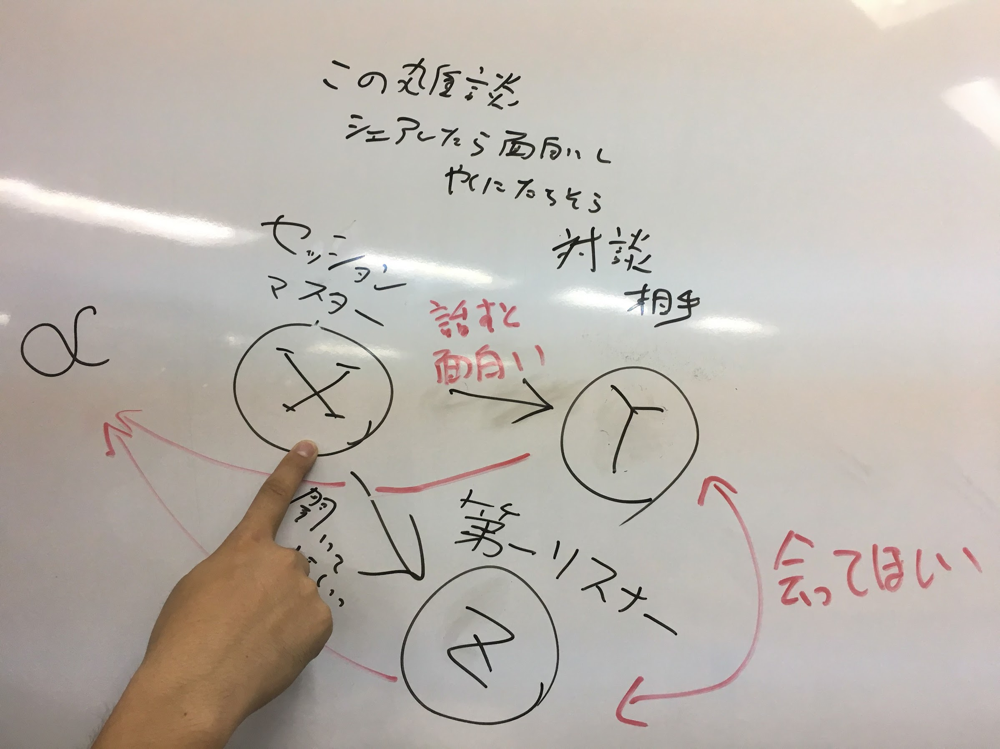

# 本郷 超会議 2017 秋（仮）

## 巻頭メッセージ（仮）

本郷には今、スタートアップやデザイン、エンジニアリングやサイエンスに関係する多くの人たちが住んで、働いています。本郷三丁目の交差点ではそんな人達と普段からすれ違っていますが、なかなかお互い気付くことができません。

でも一緒に本郷三丁目のスタバでコーヒーを飲んでいた 2 人の横に、3 人目がたままたま通りかかって紹介することで意外な繋がりが生まれ、新しいつながりから新しい仕事やアイデアが生まれることがあります。

このイベントは、実は少し関係する人たちが繋がるきっかけを作り、そして明日中華ビストロ龍蔵でランチミーティングを開いてより深い話ができるような、そんなきっかけを提供できるイベントにできればと思っています。そんなイベントです（仮）

### 事例

- Lab Cafe で会った人たちで起業した
- 本郷ご近所さん会で出会った二人に子供が生まれた
- スタバでコーヒーを飲んでたら、知り合いが他の人を紹介してくれて仕事が出来た
- 本郷三丁目交差点で通りがかったときに、次のミーティングの機会が生まれた
- 本郷テックガレージで起業家と出会ったら、顧客を紹介されて技術で起業した
- 友人の友人として紹介されたエンジェル投資家になってくれた

----

## 概要

### 日時（確定）

10/7 (土) 10:00 〜 19:00 

受付開始は 9:40 

### 場所（確定）

東京大学　本郷キャンパス　福武ホール ([Google Mpas](https://goo.gl/maps/jZDg54whAGG2))

### 人数

200 人（完全招待制）

### 参加者比率（仮）

完全招待制で、参加者を以下の比率にしたいと思っています（仮）

|  参加者種別 | 割合 |
|  ------ | ------ |
|  スタートアップ経営者＆社員 | 20% |
|  投資家 | 5% |
|  東大OB/OG (エンジニア) | 25% |
|  東大OB/OG (サイエンティスト) | 10% |
|  東大OB/OG (ノンエンジニア) | 15% |
|  現役東大生（と関係学生） | 15% |
|  本郷ご近所さん | 10% |

### 目的

- （当日）知り合いの知り合い同士で会ったほうが良いのではな人たちがお互いを紹介し合う
- （翌日）気の合った人と次の日に本郷辺りでランチミーティングに行く

= 忙しすぎて本郷に来れない人は参加対象ではありません

### イベントのビフォーアフター

|  イベント前 | イベント後 |
|  ------ | ------ |
|  プログラミングできれば効率化できるのに… | ちょっとだけ頼ってみよう |
|  この業界の顧客に会いたい…けど知らない… | あの人が知ってそう |
|  ちょっとした相談がしたい…でも友達がいない… | あの人に10分電話して聞こう |

### イベントの大方針

- 参加者で一緒にビルドしていく
- 聞く人もセッションで発言する
- 余白を作る 

----

## 登壇者（仮）

順次公開予定です。

----

## セッション

[セッションの詳細一覧（招待者のみ閲覧可）](https://scrapbox.io/hongoclub2017fall/)

|  開始時間 | 終了時間 | 会場A | 会場B | 会場C |
|  ------ | ------ | ------ | ------ | ------ |
|  10:00 | 10:30 | A1 | B1 | C1 |
|  10:35 | 11:05 | A2 | B2 | C2 |
|  11:10 | 11:40 | A3 | B3 | C3 |
|  11:45 | 12:15 | ご飯講演  |
|  12:20 | 12:50 | A5 | B5 | C5 |
|  12:55 | 13:25 | A6 | B6 | C6 |
|  13:30 | 14:00 | A7 | B7 | C7 |
|  14:05 | 14:35 | A8 | B8 | C8 |
|  14:40 | 15:10 | A9 | B9 | C9 |
|  15:15 | 15:45 | A10 | B10 | C10 |
|  15:50 | 16:20 | A11 | B11 | C11  |
|  16:25 | 16:55 | A12 | B12 | C12 |
|  17:00 | 17:30 | A13 | B13 | C13 |
|  17:35 | 18:05 | ラップアップ全体講演 |
|  18:10 | 19:30 | 懇親会   |

- A 会場: 200 名
- B 会場: 32 名
- C 会場: 16 名（ワークショップ等）

----

## セッションマスターの方へ

セッションマスター(X)のお引き受けありがとうございます。

まず、運営側(α)が想定ているテーマをお伝えします。それを踏まえた上で、ある程度自由度を持って題名を決めていただき、どなたか一人一緒にステージでお話していただける相手(Y)を運営と相談の上で決めていただきます。次に誰か一人聞かせたい相手がいるとしたら彼/彼女というリスナー(Z)を運営(α)と相談の上決めていただきます。

その上で、題名や話す内容をちょっといろいろ考えていただき当日みんなと知識や経験、アイディアをシェアいただければありがたいと思っております。

### セッションルール

- 生々しいもの、現場感のあるもの、本郷のコミュニティを作れるもの
- 意識低めの人でも興味を持ちそうな感じで
- 他でもありそうなものは外したり、ここでしかないわ〜みたいなの
- 2, 3 種類の人たちが興味を持ちそうなもの
- 誰か一人のためのセッションにしてください（招待してください）
- 本郷で次の日にアクションを起こせるような人を呼んで下さい（有名人過ぎて本郷に来ない人は呼ばないでください）
- 完全招待制かつクローズドのイベントなので、あまり広めないでください
- シークレットだからこそ喋られる内容をお勧めしています

----

## 登壇者の方へ

- 登壇するセッションの 15 分前にはお越しください
- 基本はスライドを使わないセッションです

----

## 招待者の方へ

- 必ず Peatix の QR コードをご持参ください。招待制のイベントのため、コードをお持ちで無い方は入場をお断りさせていただきます。

----

## 主催＆協力

主催：本郷ご近所さん会

Theme by [orderedlist](https://github.com/orderedlist)