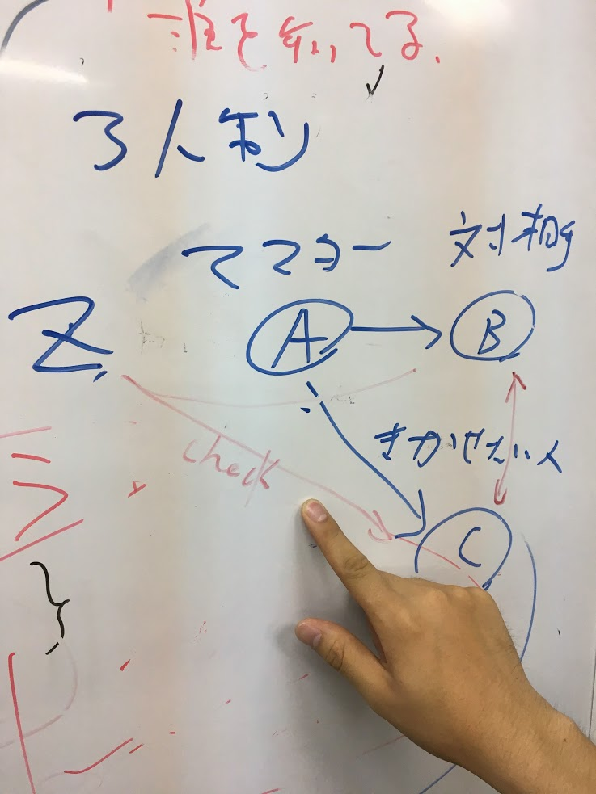

## 巻頭メッセージ（仮）

- 本郷のちょっと知ってる人、見たことある人の知らない面を知る
- 何を知ってて、何に関心があって、誰を知っているかを知る
- 知った人とその次の日にランチミーティングに行ける
- セレンディピティ（仮）の発生確率を上げる
- スタートアップが原動力となる

そんなイベントです（仮）

----

## 概要

### 日時

10/7 (土) 10:00 〜 19:00 （ここは確定してます）

### 場所

福武ホール（http://fukutake.iii.u-tokyo.ac.jp/status/)

### 人数

200 人（完全招待制）

### 目的

- （当日）会いきれていない人たちがお互いを紹介し合う
- （翌日）気の合った人たちとランチミーティングに行く

= 忙しすぎて本郷に来れない人は参加対象ではありません

### イベントの大方針

- 参加者で一緒にビルドしていく
- 聞く人も参加する

### イベントのビフォーアフター

|  イベント前 | イベント後 |
|  ------ | ------ |
|  この業界の顧客に会いたい…けど知らない… | あの人が知ってそう |
|  ちょっとした相談がしたい… | 10分電話して聞ける相手がいる |

----

## 登壇者（仮）

1. 杉本雅明
1. 鎌田冨久
1. 栗原さあや
1. 馬田隆明

----

## セッション

[セッションの詳細一覧（招待者のみ）](https://scrapbox.io/hongoclub2017fall/)

|  開始時間 | 終了時間 | 会場A (福武ホール) | 会場B (32名部屋) | 会場C (16 名部屋) |
|  ------ | ------ | ------ | ------ | ------ |
|  10:00 | 10:30 | A1 | B1 | C1 |
|  Fri Dec 29 1899 18:35:00 GMT-0700 (MST) | Fri Dec 29 1899 19:05:00 GMT-0700 (MST) | A2 | B2 | C2 |
|  Fri Dec 29 1899 19:10:00 GMT-0700 (MST) | Fri Dec 29 1899 19:40:00 GMT-0700 (MST) | A3 | B3 | C3 |
|  Fri Dec 29 1899 19:45:00 GMT-0700 (MST) | Fri Dec 29 1899 20:15:00 GMT-0700 (MST) | 全体講演 |  |  |
|  Fri Dec 29 1899 20:20:00 GMT-0700 (MST) | Fri Dec 29 1899 20:50:00 GMT-0700 (MST) | A5 | B5 | C5 |
|  Fri Dec 29 1899 20:55:00 GMT-0700 (MST) | Fri Dec 29 1899 21:25:00 GMT-0700 (MST) | A6 | B6 | C6 |
|  Fri Dec 29 1899 21:30:00 GMT-0700 (MST) | Fri Dec 29 1899 22:00:00 GMT-0700 (MST) | A7 | B7 | C7 |
|  Fri Dec 29 1899 22:05:00 GMT-0700 (MST) | Fri Dec 29 1899 22:35:00 GMT-0700 (MST) | A8 | B8 | C8 |
|  Fri Dec 29 1899 22:40:00 GMT-0700 (MST) | Fri Dec 29 1899 23:10:00 GMT-0700 (MST) | A9 | B9 | C9 |
|  Fri Dec 29 1899 23:15:00 GMT-0700 (MST) | Fri Dec 29 1899 23:45:00 GMT-0700 (MST) | A10 | B10 | C10 |
|  Fri Dec 29 1899 23:50:00 GMT-0700 (MST) | Sat Dec 30 1899 00:20:00 GMT-0700 (MST) | 全体講演 |  |  |
|  Sat Dec 30 1899 00:25:00 GMT-0700 (MST) | Sat Dec 30 1899 00:55:00 GMT-0700 (MST) | A12 | B12 | C12 |
|  Sat Dec 30 1899 01:00:00 GMT-0700 (MST) | Sat Dec 30 1899 01:30:00 GMT-0700 (MST) | A13 | B13 | C13 |
|  Sat Dec 30 1899 01:35:00 GMT-0700 (MST) | Sat Dec 30 1899 02:05:00 GMT-0700 (MST) | A14 | B14 | C14 |

- A 会場: 200 名
- B 会場: 32 名
- C 会場: 16 名（ワークショップ）

----

## 登壇者への依頼

- 誰か一人のためのセッションにしてください（招待してください）
- 本郷で次の日にアクションを起こせるような人を呼んで下さい（有名人過ぎて本郷に来ない人は呼ばないでください）
- 完全招待制かつクローズドのイベントなので、あまり広めないでください

### セッションルール

- 生々しいもの、現場感のあるもの、本郷のコミュニティを作れるもの
- 意識低めの人でも興味を持ちそうな感じで
- 他でもありそうなものは外したり、ここでしかないわ〜みたいなの

### セッションマスターの ABC ルール

1. セッションマスターが
1. 対談相手を選んで
1. 聞いて欲しい人を具体的に一人想像する

----

## 主催＆協力

主催：本郷ご近所さん会
協力：東京大学産学協創推進本部

トピック
生々しいもの、現場感のあるもの、IVSとか意識高いのとは違うもの、本郷のコミュニティを作れるもの
意識低めの人でも興味を持ちそうな感じで
他でもありそうなものは外したり、ここでしかないわ〜みたいなの
最終成果物
人材のプールとネットワークを作る（＝Transactive Memory を作る: 誰に何を聞けばいいか分かる）
Call to Action
有名人＆忙しすぎる人は呼ばない
大方針
ずれと余白を作る
Give and Give な人たちを連れてきて繋ぐ
誰か居たら紹介してね、みたいな感じでナッジする
解決できるモデルケース
ロボテクの人が一人いたら研究進んだのに…　→　おお、あいついるじゃん
この顧客インタビューがしたいのに…　→　あの人に聞いてみたら繋がるかも
セッションの形式
2, 3 人のトークセッションが中心
二つ以上のジャンルの参加者が興味を持ちそうなもの
セッションの最後にアクションを決める
やってみたいこと
圧倒的な手作り感とハイテク（https://grip.events/ みたいなアプリを使う）
やりたいことのポストイットを貼るボード（スタートアップ横断サークルとか）
このイベントでマッチングしてコーヒー飲む約束したら 500 円（スタバカード, UT Cafe カードみたいな）
